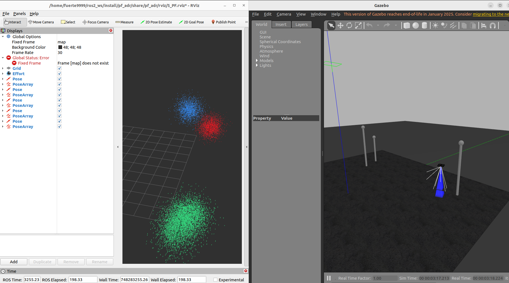
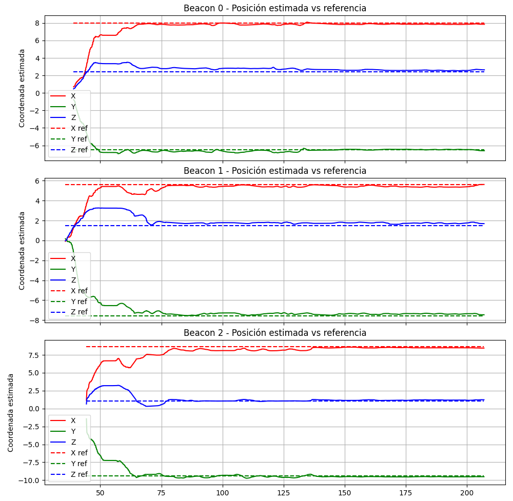

# 🎯 Particle Filter for Beacon Localization

<div align="center">


**Advanced particle filtering implementations for real-time beacon position estimation in ROS2**

[📚 Documentation](docs/) • [🎥 Demo Videos](https://drive.google.com/drive/folders/1R675cugDEPXwAdzKYmMFq00smihU1Ul_?usp=drive_link) • [🐛 Report Bug](https://github.com/rme19/pf_adr/issues)

</div>

---

## 📖 Overview

This ROS2 package implements **three distinct particle filter approaches** for estimating the position of multiple fixed beacons using a simulated drone. Each implementation offers unique advantages for different scenarios and computational constraints.

<div align="center">
  
  <p><em>Particle filter visualization in RViz with Gazebo simulation</em></p>
</div>

### 🚀 Key Features

- **Three Implementation Variants**: Basic PF, Smart PF, and PF+EKF hybrid
- **Real-time Visualization**: Live particle cloud rendering in RViz
- **Automated Data Logging**: CSV export for post-processing and analysis
- **Configurable Parameters**: Easily adjust particle count, noise levels, and beacon numbers
- **Gazebo Integration**: Full simulation environment with drone control

---

## 🔬 Implementation Approaches

### 1️⃣ Basic Particle Filter

A straightforward implementation that spawns **one particle filter node per beacon**, each maintaining a constant number of particles.

**Best for:** Simple scenarios with limited beacons and stable computational resources.

```
┌─────────────┐     ┌─────────────┐     ┌─────────────┐
│  Beacon 1   │────▶│   PF Node   │────▶│  Estimate   │
└─────────────┘     └─────────────┘     └─────────────┘
                    (N particles)
```

### 2️⃣ Smart Particle Filter

An **adaptive approach** that dynamically redistributes particles based on active beacon count, maintaining a constant **global particle budget**.

**Best for:** Scenarios with varying beacon visibility and computational constraints.

```
┌──────────────────┐
│ Activity Monitor │
└────────┬─────────┘
         │ (Active beacon count)
         ▼
┌─────────────────────────────────────┐
│  Dynamic Particle Redistribution    │
│  Total particles = constant         │
└─────────────────────────────────────┘
         │
         ▼
┌────────┴────────┬────────────┬──────────┐
│   PF Node 1     │ PF Node 2  │ PF Node N│
│ (N/active pcs)  │(N/active)  │(N/active)│
└─────────────────┴────────────┴──────────┘
```

### 3️⃣ Particle Filter + Extended Kalman Filter (Hybrid)

A **hybrid approach** that transitions from particle filtering to EKF when the particle cloud achieves sufficient Gaussianity.

**Best for:** Long-running estimations where computational efficiency is critical after convergence.

```
┌─────────────┐     ┌──────────────────┐
│   Beacon    │────▶│  PF Node (Init)  │
└─────────────┘     └────────┬─────────┘
                             │
                    ┌────────▼─────────┐
                    │ Gaussianity Test │
                    └────────┬─────────┘
                             │ (Threshold met)
                             ▼
                    ┌─────────────────┐
                    │   EKF Node      │
                    │ (Low-cost est.) │
                    └─────────────────┘
```

**How it works:**
1. PF estimates beacon position until convergence
2. Gaussianity test monitors particle distribution
3. When threshold is met, PF computes mean & covariance
4. EKF takes over using PF's final estimate as initialization
5. PF freezes to avoid redundant computation

---

## 🛠️ Installation

### Prerequisites

- **ROS2 Humble** (or compatible distribution)
- **Gazebo** simulation environment
- **Python 3.8+**

### Setup

```bash
# Create workspace
mkdir -p ~/ros2_ws/src
cd ~/ros2_ws/src

# Clone repository with submodules
git clone --recurse-submodules https://github.com/rme19/pf_adr.git

# Build workspace
cd ~/ros2_ws
colcon build
source install/setup.bash
```

---

## 🎮 Usage

### Configuration

Before launching, configure the number of beacons and filter parameters:

| **Implementation** | **Launch File** | **Drone Launch File** | **Parameters** |
|-------------------|-----------------|----------------------|----------------|
| Basic PF | `launch_completo.py` | `sjtu_drone_fp.launch.py` | `num_beacons`, particle count, resampling noise |
| Smart PF | `launch_completo_2.py` | `sjtu_drone_fp.launch.py` | `num_beacons`, global particle budget |
| PF + EKF | `launch_completo_ekf.py` | `sjtu_drone_fp.launch.py` | `num_beacons`, Gaussianity threshold, noise levels |

### Running Simulations

#### 🔹 Basic Particle Filter

```bash
cd ~/ros2_ws
source install/setup.bash
ros2 launch pf_adr launch_completo.py
```

**What launches:**
- ✅ Gazebo simulation
- ✅ Drone teleop control
- ✅ RViz with particle cloud visualization
- ✅ N beacon nodes + N PF nodes

#### 🔹 Smart Particle Filter

```bash
cd ~/ros2_ws
source install/setup.bash
ros2 launch pf_adr launch_completo_2.py
```

**What launches:**
- ✅ Gazebo simulation
- ✅ Drone teleop control
- ✅ RViz with particle cloud visualization
- ✅ N beacon nodes + N PF nodes + Activity monitor node

#### 🔹 Particle Filter + EKF

```bash
cd ~/ros2_ws
source install/setup.bash
ros2 launch pf_adr launch_completo_ekf.py
```

**What launches:**
- ✅ Gazebo simulation
- ✅ Drone teleop control
- ✅ RViz with particle cloud visualization
- ✅ N beacon nodes + N PF nodes + N EKF nodes

### 🔍 Monitoring Beacon Positions

To retrieve the ground truth position of a specific beacon:

```bash
ros2 param get beacon_node_{id}/target_position
```

Replace `{id}` with the beacon identifier (e.g., `0`, `1`, `2`).

---

## 📊 Data Analysis & Visualization

All implementations automatically generate **CSV log files** stored in `$HOME/pf_logs/` for post-processing.

### Generating Plots

Navigate to the scripts directory:

```bash
cd ~/ros2_ws/src/pf_adr/src/pf_adr/pf_adr
```

Run the appropriate visualization script:

| **Implementation** | **Script** |
|-------------------|-----------|
| Basic PF | `python3 graficas_sin_num_particulas.py` |
| Smart PF | `python3 graficas.py` |
| PF + EKF | `python3 graficas_ekf.py` |

### 📸 Sample Results

<div align="center">
  <table>
    <tr>
      <td align="center">
        <br>
        <em>Test 2 - Configuration 1</em>
      </td>
      <td align="center">
        <br>
        <em>Test 2 - Configuration 2</em>
      </td>
    </tr>
    <tr>
      <td align="center">
        <br>
        <em>Test 1 - 4 Beacons</em>
      </td>
      <td align="center">
        <br>
        <em>Test 2 - 4 Beacons</em>
      </td>
    </tr>
  </table>
</div>

---

## 📁 Project Structure

```
pf_adr/
├── 📂 src/
│   └── pf_adr/
│       ├── pf_adr/          # Core filter implementations
│       ├── launch/          # Launch files
│       ├── rviz/            # RViz configurations
│       └── config/          # Parameter files
├── 📂 media/                # Screenshots and recordings
├── 📂 docs/                 # Additional documentation
└── README.md
```

---

## 🎥 Demo & Results

For video demonstrations and additional screenshots, visit our **[Google Drive folder](https://drive.google.com/drive/folders/1R675cugDEPXwAdzKYmMFq00smihU1Ul_?usp=drive_link)**.

---

## 🤝 Contributing

Contributions are welcome! Please feel free to submit issues or pull requests.

---

## 📄 License

This project is licensed under the MIT License - see the LICENSE file for details.

---

## 👨‍💻 Authors

**Fernando Román**
**Andrés Martínez**
**Roberto Morales**
**Marcos Ortíz**


---

